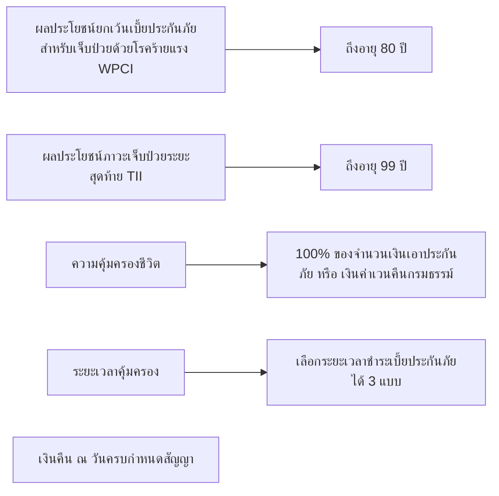

# Page Overview
This page appears to be part of an insurance document, specifically detailing the benefits and protection offered by the "AIA PAY LIFE PLUS" insurance plan. The document is in Thai, and the layout includes a mix of text, diagrams, and visual elements to convey information about the insurance coverage.

## Content Analysis
The page is divided into sections that explain the benefits and protection offered by the AIA PAY LIFE PLUS insurance plan. The main topics covered include:

1. **Protection and Benefits**: The page highlights the benefits of the insurance plan, including protection against critical illnesses and terminal illnesses.
2. **Coverage Period**: The document explains the coverage period and the options available for premium payment.
3. **Benefits Payout**: It details the conditions under which benefits are paid out, including critical illness, terminal illness, and maturity benefits.

The content is structured to provide a clear overview of the insurance plan's features and benefits.

## Visual Elements

### Images and Figures
None present.

### Diagrams and Flowcharts
The page contains a diagram that illustrates the benefits and coverage period of the AIA PAY LIFE PLUS insurance plan. The diagram can be recreated using Mermaid syntax as follows:

### Tables
None present.

### Layout and Design
The page has a clean and organized layout, with headings and subheadings used to structure the content. The use of pink and red accents adds visual appeal and draws attention to key information. The diagram is prominently displayed, making it easy to understand the benefits and coverage period of the insurance plan.

## Extracted Text
The text content from the page is as follows:

**ภาพแสดงผลประโยชน์ และความคุ้มครองชีวิต**
**AIA PAY LIFE PLUS**
เอไอเอ เพย์ ไลฟ์ พลัส ชำระเบี้ยประกันภัย 10 ปี 15 ปี 20 ปี (ไม่มีเงินปันผล)

ผลประโยชน์ยกเว้นเบี้ยประกันภัยสำหรับเจ็บป่วยด้วยโรคร้ายแรง (WPCI)
(ขึ้นอยู่กับกฎเกณฑ์การพิจารณารับประกันของบริษัท)
ถึงอายุ 80 ปี

ความคุ้มครองชีวิต
ผลประโยชน์ภาวะเจ็บป่วยระยะสุดท้าย (TII)
100% ของจำนวนเงินเอาประกันภัย หรือ เงินค่าเวนคืนกรมธรรม์
(ขึ้นอยู่กับกฎเกณฑ์การพิจารณารับประกันของบริษัท)
ถึงอายุ 99 ปี

จำนวนเบี้ยประกันภัยหลักที่ได้ชำระมาแล้วทั้งหมด ในกรณีที่มีการลดจำนวนเงินเอาประกันภัยในระหว่างที่กรมธรรม์มีผลบังคับ จำนวนเบี้ยประกันภัยก่อนที่จะมีการลดจำนวนเงินเอาประกันภัยจะลดลงตามสัดส่วนของจำนวนเงินเอาประกันภัยที่ลดลง ทั้งนี้ หากผู้เอาประกันภัยเสียชีวิตระหว่างปีกรมธรรม์ บริษัทจะคำนวณเบี้ยประกันภัยดังกล่าวเต็มปีกรมธรรม์

ระยะเวลาคุ้มครอง
เลือกระยะเวลาชำระเบี้ยประกันภัยได้ 3 แบบ
ถึงอายุ 99 ปี

เงินคืน ณ วันครบกำหนดสัญญา

*** กรณีมีชีวิตอยู่ตลอดสัญญา จะจ่ายผลประโยชน์จำนวนใดจำนวนหนึ่งที่มากกว่าประโยชน์ระหว่าง
* 100% ของจำนวนเงินเอาประกันภัย
* เงินค่าเวนคืนกรมธรรม์
* จำนวนเบี้ยประกันภัยหลักที่ได้ชำระมาแล้วทั้งหมด ในกรณีที่มีการลดจำนวนเงินเอาประกันภัยในระหว่างที่กรมธรรม์มีผลบังคับ จำนวนเบี้ยประกันภัยก็จะมีการลดจำนวนเงินเอาประกันภัยที่ลดลงตามสัดส่วนของจำนวนเงินเอาประกันภัยที่ลดลง

* ผู้เอาประกันภัยควรศึกษารายละเอียดของกรมธรรม์ประกันภัย เพื่อให้เข้าใจเงื่อนไขและระยะเวลาคุ้มครอง
* การพิจารณารับประกันภัยเป็นไปตามหลักเกณฑ์ของบริษัท
* ข้อกำหนดและเงื่อนไขเป็นไปตามที่บริษัทกำหนด